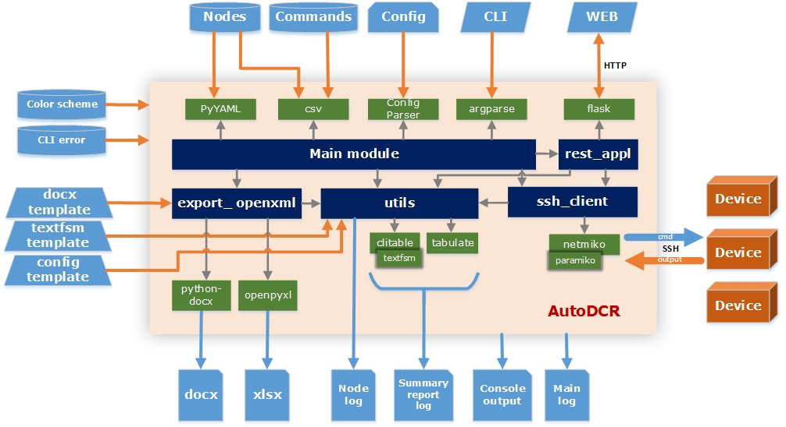

# AutoDCR

**Automatization device configurations and reporting**

----

## Architecture

This tools is designed for automatization tasks of device configurations and reporting: batch command execution for list of nodes with subsequent verification of command output (result) and prepare reports.

Tools connecting to each node in the csv/yaml file: data/nodes.csv, and execute each command in the file: data/commands.csv. After that, will be generated summary report of executions each commands on each nodes and full log for each nodes in subfolder 'report'.

----

## Documentations

- [Installation](install/install.md)
- [User guide](docs/userguide.md)
- [Nodes](docs/nodes.md)
- [Commands](docs/commands.md)
- [Utils](docs/utils.md)
- [Docx template](docs/protocol_template.md)
- [Configuration template](docs/configuration_template.md)
- [Release notes](install/release-notes.md)
- [Changelog](install/changelog.md)
- [Road map](docs/roadmap.md)
- [Thanks](docs/thanks.md)
- [About](docs/about.md)
- [License](install/license.md)

Also to view documentations you can go to GitHub Pages of project [AutoDCR](https://yesteshenko.github.io)

----
